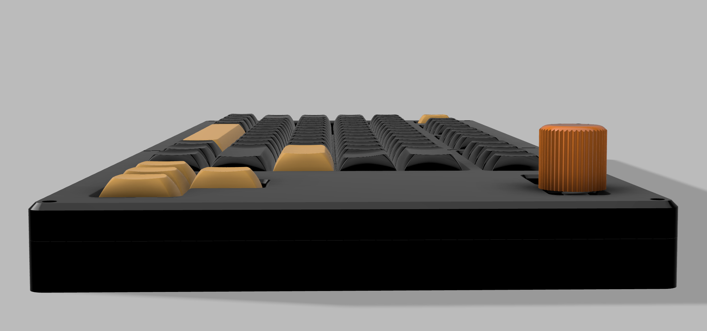
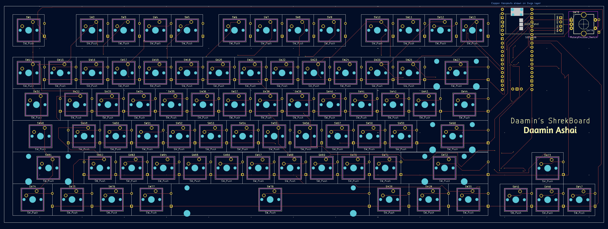
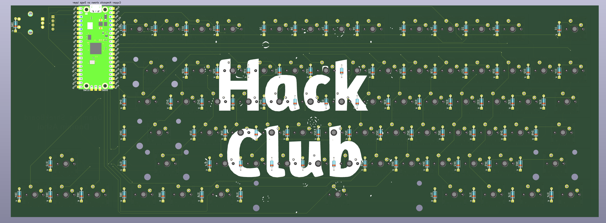

# Daamin's Keyboard - ShrekBoard

Made by [Daamin](https://daamin.tech)

Features:

- 78x keys!
- TKL Layout minus (9 keys above the arrow keys) and Fn moved to the bottom-left.
- An extra USB-C hub for other devices and accessories, uses SL2.1A IC.
- 0.91" OLED for Pictures, Current - Playing Media etc
- EC11 Rotary Encoder - For Volume, Brightness etc
- Hack Club branded PCB 😎
- Comfy Design
- KMK firmware

## PCB

The PCB's size is 360.4mm x 130.4mm

| Schematic                     |
| ----------------------------- |
|  |

| Front                     |
| ------------------------- |
|  |

| Back                     |
| ------------------------ |
|  |

| 3D - Front                   |
| ---------------------------- |
|  |

| 3D - Back                   |
| --------------------------- |
|  |

## Case

Thickness:-

- Top: 7mm
- Plate: 1.5mm
- Bottom: 11.5mm
- **Total**: 20mm
  
  
  
  

The case was made in Fusion360.

I chose to add branding on the bottom case and plate.
PS:- The top case also has branding on the bottom side, not on top because I thought it might ruin the aesthetics.

## 3D Render:

## BOM

| Name                                                          | Qty | Price (INR - incl. shipping) | Link                                                                                                     |
| ------------------------------------------------------------- | --- | ---------------------------- | -------------------------------------------------------------------------------------------------------- |
| Gateron G Pro 3.0 Switch Yellow                               | 80  | 1544                         | [here](https://meckeys.com/shop/accessories/keyboard-accessories/key-switches/gateron-g-pro-3-0-switch/) |
| Cherry Profile PBT Keycaps                                    | 1   | 1399                         | [here](https://curiositycaps.in/products/blue-rose-mechainner-blue-cherry-pbt-keycaps)                   |
| Durock Smokey Screw-In Stabilizers V2 (4+1 w/ 6.25u spacebar) | 1   | 1595                         | [here](https://stackskb.com/store/durock-smokey-screw-in-stabilizers-v2/)                                |
| Diode 1N4148 Through - Hole                                   | 100 | 169                          | [here](https://amzn.in/d/j3eLvoh)                                                                        |
| 0.91" OLED SSD1306                                            | 1   | 278                          | [here](https://amzn.in/d/3cISYEV)                                                                        |
| EC11 Rotary Encoder (Pack of 2)                               | 1   | 249                          | [here](https://amzn.in/d/hVRxzij)                                                                        |
| M3 x 20mm Bolt (Pack of 15)                                   | 1   | 149                          | [here](https://amzn.in/d/8GRQWAB)                                                                        |
| M3 mm Bolts - (Pack of 8)                                     | 1   | 108                          | [here](https://amzn.in/d/7UQtsm8)                                                                        |
| M3 x 5mm Heatset Insert (Pack of 25)                          | 1   | 214                          | [here](https://amzn.in/d/ixybuAc)                                                                        |
| Orph/Raspberry Pi Pico                                        | 1   | From HackClub HQ             |
| Rotary Encoder Knob                                           | 1   | From HackClub HQ             |
| Top Case (Black "./production/TOP.step")                      | 1   | From HackClub HQ             |
| Bottom Case (white "./production/BOTTOM.step")                | 1   | From HackClub HQ             |
| Middle Plate ("./production/MIDDLE.step")                     | 1   | From HackClub HQ             |
| PCB - (Black Color)                                           | 1   | From HackClub HQ             |

## Notes :-

I want all the three 3D-printed parts to be printed in black color.
^ that includes: TOP.step, BOTTOM.step, MIDDLE.step.
I want the 1x Rotary encoder knob as well.

Some of the above items, were ordered in packs due to unavailability of singular items.
2x extra switches, extra keycaps, extra nuts, bolts, heatsets, diodes, and one extra RE (can be used for my hackpad, if not sent from hackclub.)
