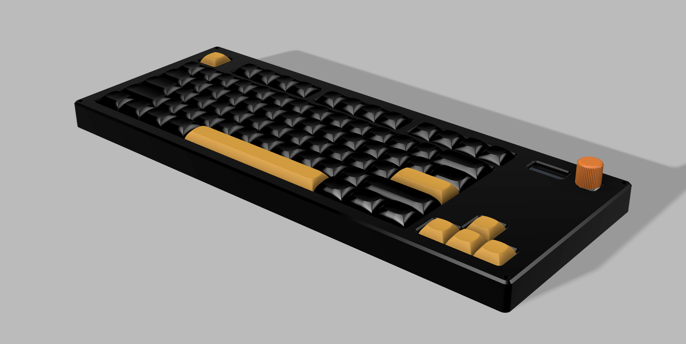
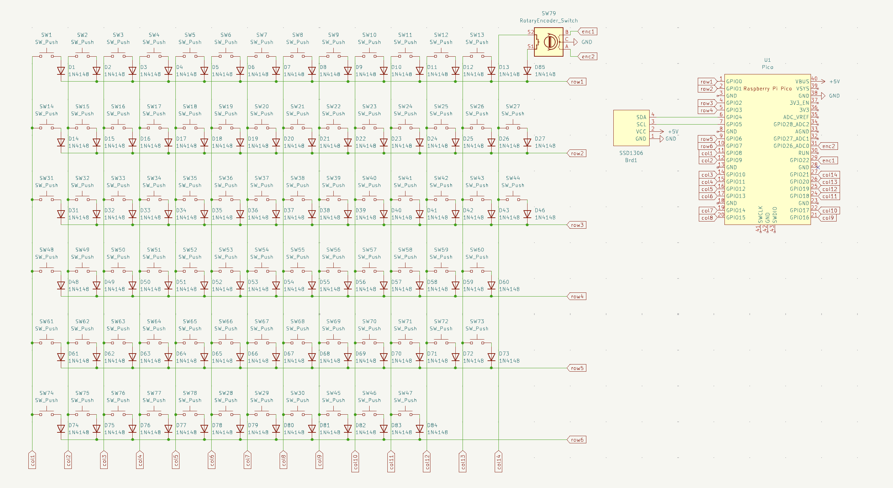
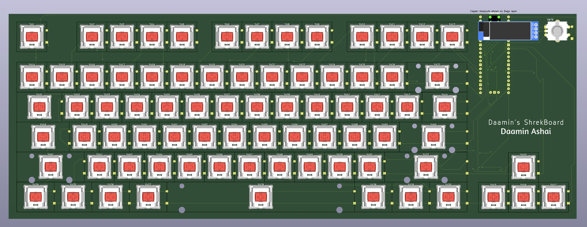
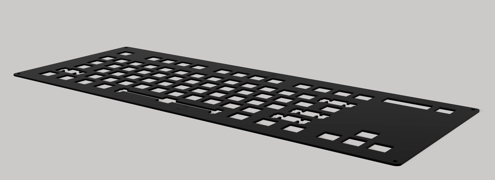
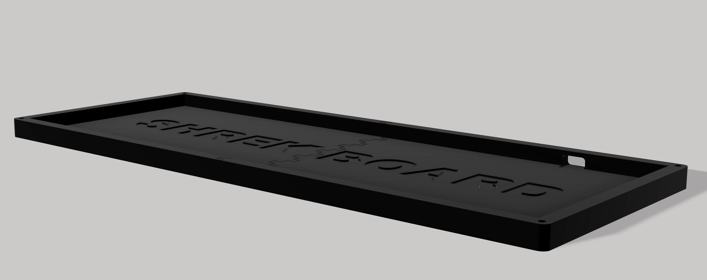
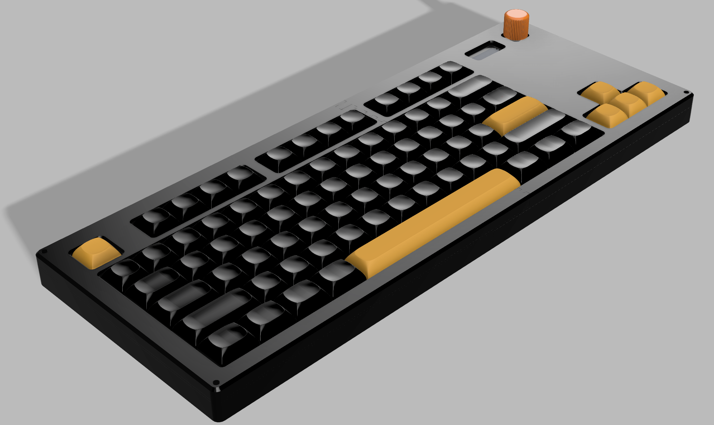
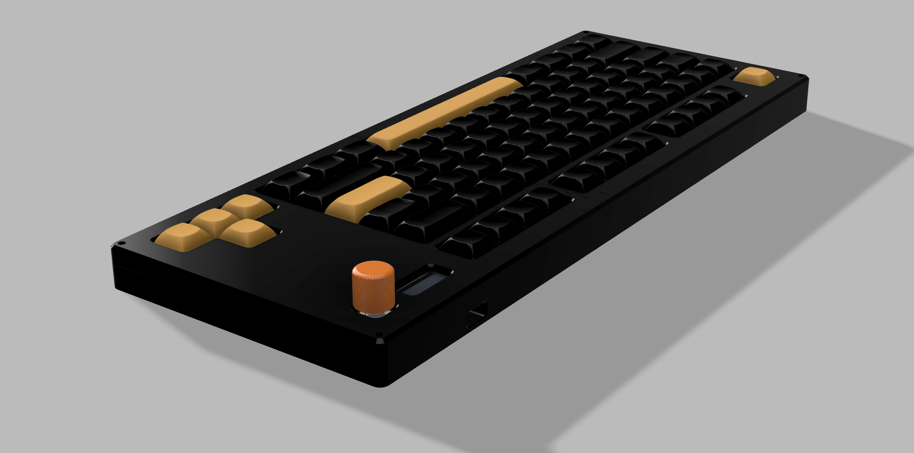
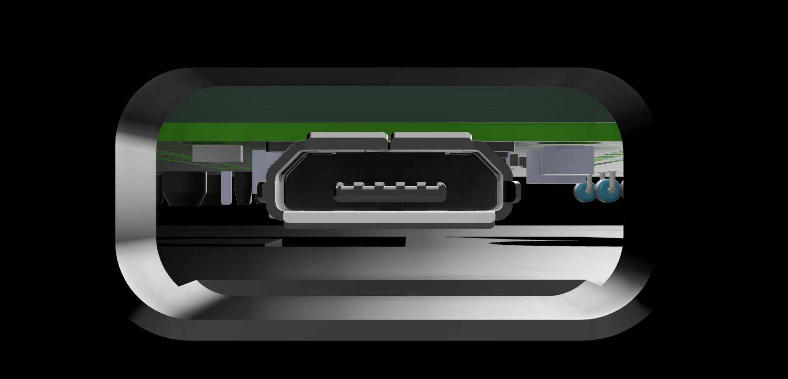
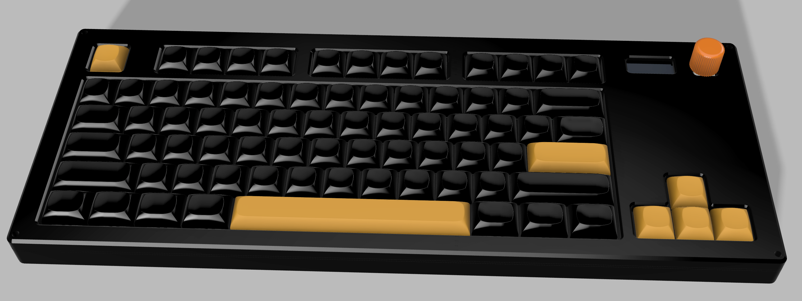

# Daamin's Keyboard - ShrekBoard

Made by [Daamin](https://daamin.tech)

Features:

- 78x keys!
- TKL Layout minus (9 keys above the arrow keys) and Fn moved to the bottom-left.
- 0.91" OLED for Pictures, Current - Playing Media etc
- EC11 Rotary Encoder - For Volume, Brightness etc
- Hack Club branded PCB 😎
- Raspberry Pico USB-C replacement: [Orpheus Pico](https://orpheuspico.hackclub.com/)
- Comfy Design
- KMK firmware

## PCB

The PCB's size is 360.4mm x 130.4mm

| Schematic                     |
| ----------------------------- |
|  |

| Front                     |
| ------------------------- |
|  |

| Back                     |
| ------------------------ |
|  |

| 3D - Front                   |
| ---------------------------- |
|  |

| 3D - Back                   |
| --------------------------- |
|  |

## Case

Thickness:-

- Top: 7mm
- Plate: 1.5mm
- Bottom: 11.5mm
- **Total**: 20mm
  
  
  
  

The case was made in Fusion360.

I chose to add branding on the bottom case only for aesthetics.
In order for the parts to be 3d printed, they're divided into 2 each.

# Top:

# Middle Plate:

# Bottom:

## 3D Render:

## Layout:

The Layout is a TKL (Tenkey-less) layout with some mods.

- removing Home, End etc island
- removing PrtSc etc island
- moving Fn key to bottom-left

## BOM

| Name                                                          | Qty | Final Price - INR (USD)         | Link                                                                                                       |
| ------------------------------------------------------------- | --- | ------------------------------- | ---------------------------------------------------------------------------------------------------------- |
| Gateron EF Grayish                                            | 80  | 1560 ($18.15)                   | [here](https://neomacro.in/products/gateron-ef-grayish)                                                    |
| Cherry Profile PBT Keycaps                                    | 1   | 1500 ($17.45)                   | [here](https://stackskb.com/store/black-and-yellow-keycaps/)                                               |
| Durock Smokey Screw-In Stabilizers V2 (4+1 w/ 6.25u spacebar) | 1   | 1595 ($18.55)                   | [here](https://stackskb.com/store/durock-smokey-screw-in-stabilizers-v2/)                                  |
| Diode 1N4148 Through - Hole                                   | 100 | 169 ($1.97)                     | [here](https://amzn.in/d/j3eLvoh)                                                                          |
| 0.91" OLED SSD1306                                            | 1   | 278 ($3.23)                     | [here](https://amzn.in/d/3cISYEV)                                                                          |
| EC11 Rotary Encoder (Pack of 2)                               | 1   | 249 ($2.9)                      | [here](https://amzn.in/d/hVRxzij)                                                                          |
| M3 x 20mm Bolt (Pack of 15)                                   | 1   | 149 ($1.73)                     | [here](https://amzn.in/d/8GRQWAB)                                                                          |
| M3 Nuts - (Pack of 8)                                         | 1   | 108 ($1.26)                     | [here](https://amzn.in/d/7UQtsm8)                                                                          |
| M3 x 5mm Heatset Insert (Pack of 25)                          | 1   | 246 ($2.86)                     | [here](https://amzn.in/d/ixybuAc)                                                                          |
| PCB - (Black Color)                                           | 1   | 3665.72 ($42.64)                | [here](https://hc-cdn.hel1.your-objectstorage.com/s/v3/c5fb1f15d2e06037b44047fc6c5d55dcc16f18ea_image.png) |
| Orpheus Pico                                                  | 1   | From HackClub HQ                |
| Rotary Encoder Knob                                           | 1   | From HackClub HQ                |
| Top Case - 1 (Black "./production/TOP1.step")                 | 1   | From HackClub HQ / Print Legion |
| Top Case - 2 (Black "./production/TOP2.step")                 | 1   | From HackClub HQ / Print Legion |
| Middle Plate - 1 (Black "./production/MIDDLE1.step")          | 1   | From HackClub HQ / Print Legion |
| Middle Plate - 2 (Black "./production/MIDDLE2.step")          | 1   | From HackClub HQ / Print Legion |
| Bottom Case - 1 (Black "./production/BOTTOM1.step")           | 1   | From HackClub HQ / Print Legion |
| Bottom Case - 2 (Black "./production/BOTTOM2.step")           | 1   | From HackClub HQ / Print Legion |

## Total Pricing

The keyboard comes out to be INR 9,519.72 ($110.73) when adding ordered parts and PCB. Does not include 3D - Printed case, Pico and Knob.
The PCB seems very costly when adding the shipping to India ($20), @qcoral please try to find alts for indians, or this is very very expensive.
PS:- (Seed Studio is $142 so thats not possible 💀)

## Notes :-

I want all the six 3D-printed parts to be printed in black color.
^ that includes: TOP1.step, TOP2.step, BOTTOM1.step, BOTTOM2.step, MIDDLE1.step and MIDDLE2.step
I want the 1x Rotary encoder knob as well.

Some of the above items, were ordered in packs due to unavailability of singular items.
2x extra switches, extra keycaps, extra nuts, bolts, heatsets, diodes, and one extra RE (can be used for my hackpad, if not sent from hackclub.)
